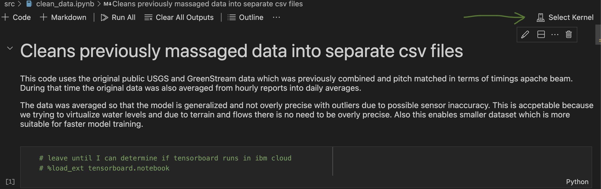

# Dir for Source


# vs code notes on python venv

## create a python environment or activate one

This workflow regarding creating a venv with the terminal seems 
broken in terms of visual code.  It will pip install twice.  I suspect
the one created with vscode is in `~/.vscode` or `~/.code.`  TODO: resolve


### create

Open terminal in vscode or use terminal on your os natively.

On mac vs-code type `ctrl shift ~`

Use the python moduloe to create a venv (virtual environment) named `myenv`.
This creates a dir named `myenv.` Make sure you add this dir to your `.gitignore`

```
$ cd src
$ python3 -m venv myenv
$ source myenv/bin/activate
```

### activate existing
```
$ source myenv/bin/activate
```

### upgrade pip

```
$ pip install --upgrade pip
```


## Install python packages

```
$ python3 -m pip install <some package>
```

or

```
$ python3 -m pip install -r requirements.txt
```

## Install python extension

1. `cmd shift x`
2. Type `python`
3. Install Python microsoft extension
4. Install Jupyter microsoft extension

## Create python venv

1. Type `cntrl shift ~` or Terminal in top menu bar
2. activte python env

## Open jupyter notebook and specify python interpreter

1. Type `cmd shift p`
2. Search `Python: Select Interpreter`
3. Navigate to dir where the python3 file is located in the venv created
    - eg. src/myenv/bin/python3


# Regarding notebooks in vscode

In the screenshot below is shows where to config the kernel for the notebook in vs-code.

1. Click `Select Kernel` (see the green arrow in screenshot)
2. Click `Python Environments...`
3. Click `+ Create Python Environment`, yes, this is weird. We already created on.  Why not have a use option?
4. Click `VENV`
5. Click `+ Enter Interpreter Path`
6. Click `Find..., Browse to your files`
7. Click `Select` and then navigate to `src/myenv/bin/python3`
8. Click the checkbox on for `src/requirements.txt` to load modules.


